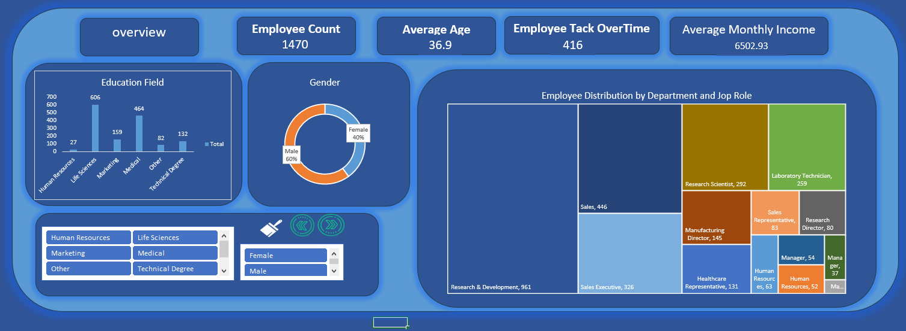
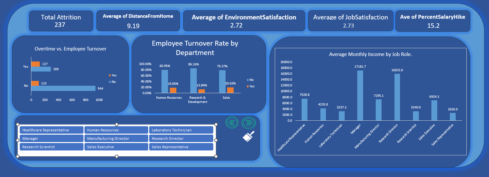
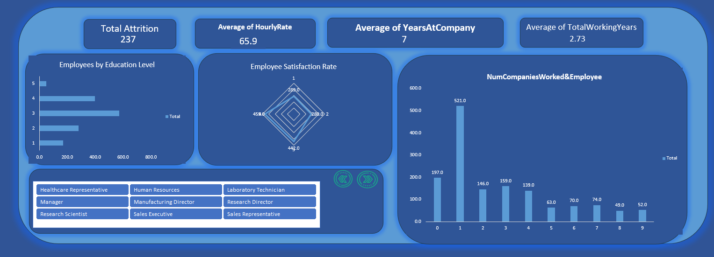

# HR Analytics Dashboard 📊

An interactive HR Analytics Dashboard built entirely in Microsoft Excel, analyzing attrition and workforce metrics for 1,470 employees using PivotTables, PivotCharts, and Slicers. The dashboard covers four key areas — employee overview, attrition drivers, department-level turnover, and workforce demographics — uncovering insights such as the strong link between overtime and attrition, and significant income gaps across job roles.

## 🖼️ Dashboard Preview

### 🏠 Home Page
Navigation hub with buttons linking to the Overview, Attrition Analysis, and More Information pages.


### 📌 Overview Page
- **Employee Count:** 1,470
- **Average Age:** 36.9
- **Employees on OverTime:** 416
- **Average Monthly Income:** $6,502.93
- Charts: Education Field distribution, Gender split (Female 40% / Male 60%), and a Treemap of employee distribution by Department & Job Role (R&D: 961, Sales: 446, Sales Executive: 326, Research Scientist: 292, Laboratory Technician: 259...)



### 📉 Attrition Analysis Page
- **Total Attrition:** 237 employees
- **Average Distance From Home:** 9.19
- **Average Environment Satisfaction:** 2.72 / 4
- **Average Job Satisfaction:** 2.73 / 4
- **Average Percent Salary Hike:** 15.2%
- Charts:
  - **Overtime vs. Employee Turnover:** Of employees who work overtime, 127 left vs. 289 who stayed. Of those who don't work overtime, only 110 left vs. 944 who stayed.
  - **Turnover Rate by Department:** Sales 20.63%, Human Resources 19.05%, Research & Development 13.84%.
  - **Average Monthly Income by Job Role:** highest for Manager ($17,181.7) and Research Director ($16,033.6); lowest for Sales Representative ($2,626.0) and Laboratory Technician ($3,237.2).



### ℹ️ More Information Page
- **Total Attrition:** 237
- **Average Hourly Rate:** 65.9
- **Average Years at Company:** 7
- Charts: Employees by Education Level, Employee Satisfaction Rate (radar chart), and Number of Companies Worked per Employee (most employees, 521, worked at only 1 previous company).



> Note: GitHub cannot render Excel PivotTables/Slicers interactively — the screenshots above show the live dashboard. Download the `.xlsx` file to interact with it in Excel.

## 📁 Repository Structure

```
HR-Analytics-Dashboard/
├── README.md
├── data/
│   └── HR_Analytics.csv
├── dashboard/
│   └── HR_Analytics_Dashboard.xlsx
└── images/
    ├── home.png
    ├── overview.png
    ├── attrition_analysis.png
    └── more.png
```

## 📊 Dataset

- **Source:** IBM HR Analytics Employee Attrition & Performance dataset
- **Rows:** 1,470 employees | **Columns:** 35 attributes
- **Key fields:** Age, Attrition, Department, Job Role, Monthly Income, Job Satisfaction, Years at Company, OverTime, etc.

## 🛠️ Tools Used

Microsoft Excel — PivotTables, PivotCharts, Slicers, KPI cards, Treemap, Radar chart, and custom dashboard design.

## 📈 Key Insights

- Overall attrition rate is **~16.1%** (237 out of 1,470 employees).
- Employees who work **overtime attrite at a much higher rate (~30.5%)** compared to those who don't (~10.4%) — overtime is one of the strongest attrition drivers in this dataset.
- **Sales (20.63%)** has the highest departmental turnover rate, followed by HR (19.05%) and R&D (13.84%).
- **Job Satisfaction (2.73/4)** and **Environment Satisfaction (2.72/4)** are both around the midpoint, suggesting room for improvement in workplace experience.
- **Managers and Research Directors** earn significantly more on average than Sales Representatives and Lab Technicians — a large income gap across job roles.
- Most employees (521 of 1,470) have worked at only **1 previous company** before joining, suggesting a relatively early-career workforce.

## 🚀 How to Use

1. Download `HR_Analytics_Dashboard.xlsx` from the `dashboard/` folder.
2. Open it in Microsoft Excel.
3. Use the slicers on each page to filter by Department, Gender, or Job Role and explore the data interactively.

## 📬 Contact

Feel free to connect with me on [LinkedIn](#) or check out my other projects.
